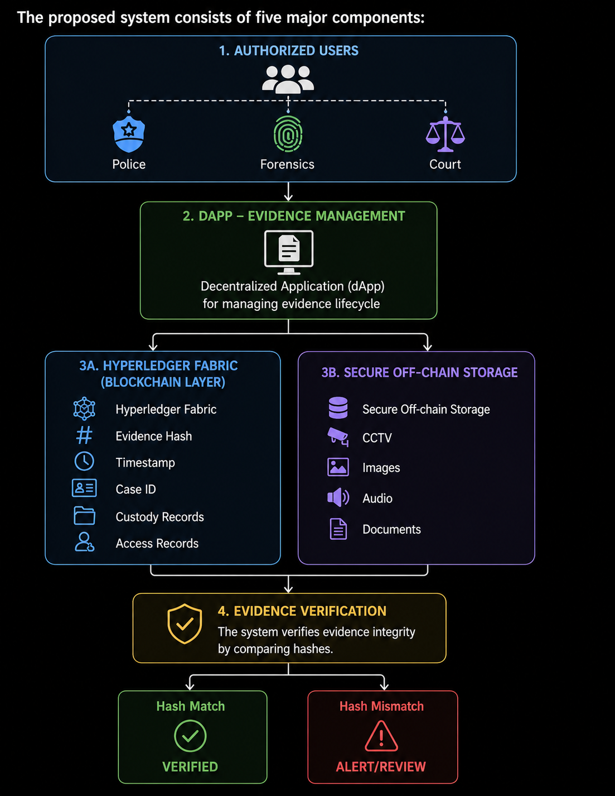
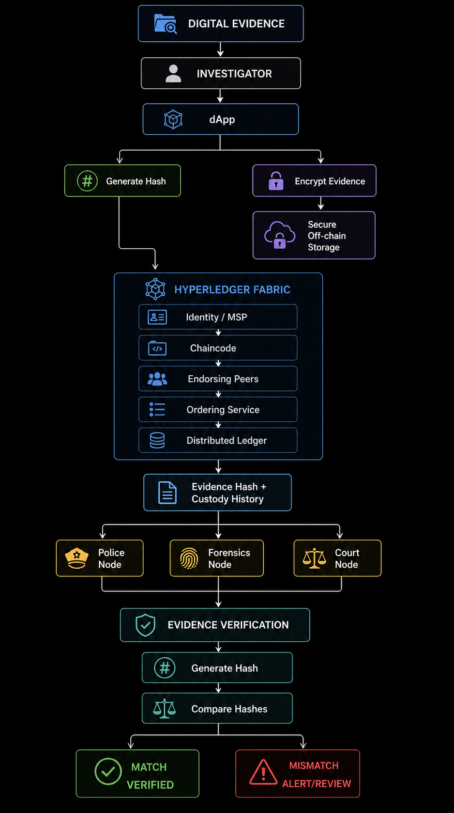

# BLOCKCHAIN BASED DIGITAL EVIDENCE MANAGEMENT SYSTEMS

## PROBLEM STATEMENT 
Digital evidence like CCTV footage, photographs, audio recordings, mobile-phone data, call recordings, emails, and other electronically stored information play an important role in criminal investigations and legal proceedings. 

At present, this evidence is stored on private computers, local servers, or centralized databases owned by investigative agencies. Although access is restricted and security measures are in place, these files can be potentially modified, replaced, and deleted without any proper evidence. In addition, there are no proper records on which employees handled the evidence and accessed it and at what time exactly. 
Furthermore, when evidence passes through multiple authorities, maintaining a reliable and transparent record of its chain of custody becomes challenging. 

This issue is especially relevant in India because  in several rural and suburban areas, some courts, police stations, forensic laboratories, and other government facilities' evidence and records may be maintained through local computer systems. 

The proposed system aims to add a tamper-evident, cryptographically verifiable record of when evidence was registered, who handled it, and whether the evidence has changed since its original registration. 

## SOLUTION
### Why is blockchain the right choice? 
1. All the involved parties, like the police department, forensics, and the justice department, will need to rely on a common database. 
2. Instead of copies of the data being stored by each department, here they all rely on the same database. 
3. Blockchain itself provides distributed redundancy; copies of the blockchain ledger are maintained across multiple participating nodes. Each node maintains a synchronized copy of the blockchain data.
4. The blockchain in itself does not store the files; it stores the hashed version of the CID for reference. The blockchain enforces smart contracts on them to ensure who can access it and control its transfers.
5. If someone modifies even a single byte of the records, then its hash changes completely. So,The network will see it as a different file and not the one that the user uploaded. This ensures immutability.
6. Digital signatures and hashes can establish who performed particular blockchain transactions. Blockchain records provide a persistent history of transactions. 
This helps in keeping a fool-proof record of custody. 

### Which blockchain ecosystem would I choose? 

1. I would choose Hyperledger Fabric. 
2. Reason: 
- The network involves known organizations rather than anonymous public users. 
- Hyperledger Fabric provides a permissioned blockchain architecture.
- Participation in the network is controlled. 
- In Ethereum and other public ecosystems, random people on the internet will be hosting the information. 
- Unrestricted public access to the hash info of cases is inappropriate
- The goal is evidence management not financial transactions. 
- Hyperledger Fabric does not require native cryptocurrencies or gas fees like other public ecosystems. 
- Everytime an evidence is registered, there is no need to pay ETH. 
- The only cost we need to incur is the operational cost of Fabric.

### OVERALL ARCHITECTURE: 

### WORKFLOW

**1.Evidence is collected by Investigators:**
- An authorised investigator collects the evidence. For example, CCTV footage from a shop. 
**2.Uploads into the dApp:**
- The system generates a unique identifiers for the evidence consisting of: 
    - Case ID: Eg., CASE-KL024561024. The case ID could itself be specifically generated: a code for which state, district, jurisdiction, and station number it is registered and the FIR number. 
    - Evidence ID: Eg., EV-00103. Corresponding to the evidence number in that particular case.
    - Evidence Type: e.g., CCTV video
    - Collected By: e.g., Investigator A

**3.Cryptographic Hash Generation:** 
- Once the dApp has created a log of the evidence information, the hash function is applied. The system loads the binary data of the file and passed it through a hashing algorithm like SHA-256, and a unique hash value is generated. 
 Eg:- A7F39C82D4E1...92BC 

**4.Encrypt and store the actual evidence off-chain:**
- The application encrypts the CCTV file using an encryption algorithm such as AES-256.
- The algorithm creates an encryption key and the encrypted CCTV video. 
- The encrypted CCTV video should be stored on the institution's dedicated secure server with backups in place. 
- The encryption key should be securely stored, as it is important when you later want to decrypt the video for hash verification. It should be stored away from the encrypted video using management systems like KMS, which is backed by Hardware Security Module (HSM) or other hardware-backed security mechanisms. 
- When the dApp later asks to access the evidence, the KMS delivers the encryption key only after ensuring it is an authorized request. 

**5.The investigator submits the evidence information to Hyperledger Fabric:** 
- The inevstigator initiates a request to create a blockchain transaction using an option in the dApp. 
- The unique identifiers generated by the dApp and the cryptographic hash of the evidence generated is to be submitted to the blockchain layer (Hyperledger Fabric).

**6.Fabric’s permissioned architecture verifies the investigator's identity:**
- Unlike a public blockchain where essentially anyone can submit transactions, Hyperledger fabric only allows authorised individuals to create transactions. 
- Verification process: 
    - The investigator has a Fabric identity containing credentials issued by a trusted Certificate Authority(CA). He has a certificate and a private key. The private key is used to sign the transaction proposal.
    - The network’s Membership Service Provider (MSP) first validates their digital certificate to verify exactly who they are and which organization they belong to.
    - Once the identity is verified, the network evaluates the relevant Fabric Policy to check if that specific identity type (e.g., an identity with an Investigator role) has the structural permission to submit requests to the channel.

**7.Transaction Endorsement and chaincode validation**
- Hyperledger Fabric has Endorsement Policies. An endorsement policy is a specific type of Fabric policy that dictates which specific organizations must sign off (endorse) a transaction before it can be written to the blockchain ledger. Eg. for the police peer sending the request, it needs to be signed by forensic peer or cybersec peer. 
- Chaincode(smart contracts in Hyperledger Fabric) validation is the process that drives endorsement.
- The client application sends the proposed transaction (RegisterEvidence) to the required endorsing peers (e.g., the Cybersecurity peer and the Forensic peer)
- Then the chaincode verifies it step by step by checking who is calling, which organization the investigator is assigned to this case, and if this investigator is allowed to register this evidence.
- Cryptographic Signing (Endorsement): If the chaincode validation passes, the peer simulates the ledger change and cryptographically signs the result using its private key that was issued to it by its Local MSP setup. 
- The peer sends this signed endorsement back to the client application, which collects them to satisfy the overall endorsement policy before sending the batch to the Ordering Service.

**8.Ordering service orders the transaction**
- The primary job of the orderer is to take transactions from various clients, arrange them into a strict chronological order, and package them into a new block. 
- Once a block is filled or a timeout is reached, the Ordering Service broadcasts this newly created block to all Committing Peers across the network including the Police, Forensic, Court node.

**9.Transaction is Committed to the Fabric ledger:**
- When a block arrives at a Committing Peer, the peer does not blindly trust it. Every single node runs the block through a final validation process before writing it to their local ledger. 
- Final Validation Process: 
   - Endorsement Policy Verification (VSCC):The peer evaluates the signatures attached to the transaction. 
   It checks: Did the Cybersecurity peer sign it? Did the Forensic peer sign it? If the signatures match the network's rule, it passes. If a signature is missing or altered, the transaction is marked as Invalid.
   - Data Conflict Check (MVCC): The peer checks if any data read during the endorsement phase has been modified by a different transaction while this block was being ordered.
   - Commit to the ledger: The peer updates its local copy of the blockchain ledger.
      - The State Database is updated with the key-value pair (Case0001 : EV-00103 : Hash).
      - The Block is appended to the permanent blockchain file on the server.
      - Even if a transaction failed Step 1 or 2, it is still saved in the block for audit history, but it is flagged as invalid so its data never updates the ledger.
- The peer emits a success event back to the dApp, confirming to the investigator that the evidence hash is permanently secured on the blockchain.

**10.All further trasnfers are recorded:**
- Every single change of hands, location shift, or status update regarding the evidence is recorded immutably to create a Chain of Custody. 
- If a judge or auditor queries the ledger for EV-00103, Hyperledger Fabric doesn't just show the current state; it uses its built-in data history capability (GetHistoryForKey) to return a clean, tamper-proof audit trail. 

**11.Evidence integrity verification:**
- Suppose the CCTV footage is eventually presented in court.
- The dApp request for the encryption key from the KMS. Decrypts the encrypted CCTV video and calculates the hash of the current file again.
- Then the dApp retrieves the stored hash value from the Fabric. It compares the two hashes, validates them, and presents them. 
- If the hashes do not match, you can use the GetHistoryForKey to access the ledger.

## CHALLENGES: 
### Data redundancy: 
1. Eliminating separate databases maintained by different organizations could appear to reduce data redundancy.
2. However, blockchain itself provides distributed redundancy.
3. Copies of the blockchain ledger are maintained across multiple participating nodes.
4. Each node maintains a synchronized copy of the blockchain data.
5. If one node becomes unavailable or experiences a failure, other nodes continue to maintain the same ledger.

### Infrastructure cost: 
1. Participating organizations still need to operate blockchain nodes and supporting infrastructure.
2. This can involve significant setup and maintenance costs.
3. Skilled maintenance staff is required. 
4. Mitigation: 
 - Begin with a limited consortium of important organizations.
 - Avoid deploying nodes everywhere immediately.
 - Need to consider using cloud infrastricture. 

### Complexity: 
1. A normal database is simple. Application -> Database
2. This application has several layers added.And it requires Blockchain engineers, infrastructure administrators, security specialists, identity management, network governance. 
3. Mitigation: 
 - Use established Fabric components. 
 - Gradual deployment. 

### Blockchain cannot guarantee if whether the original evidence uploaded was honest. 
1. Mitigation: 
 - Use proper forensic procedures.
 - Use secure evidence acquisition.
 - Perform verification before evidence is registered.

### Off-Chain Storage is still a vulnerability: 
1. If the storage server is hacked or the video is deleted, blockchain cannot recover the original video.
2. Mitigation: 
 - Encrypted storage
 - Multiple backups
 - Geographic redundancy
 - Access controls
 - Disaster recovery
 - Integrity monitoring

### Immutability can become a problem: 
1. If an investigator may accidentally record the wrong evidence hash.
2. The original blockchain record cannot simply be deleted.
3. Mitigation: 
 - Use corrective transactions rather than deleting history.

### Scalability: 
1. A large country like India could generate an enormous amount of digital evidence.
2. Recording every small interaction as a blockchain transaction could heavily load the network.
3. Mitigation: 
 - Record only important state-changing events on-chain.
 - Do not record every tiny interaction.

### Institutional resistance to adoption: 
1. Existing departments may have established workflows, databases, and approval procedures. Replacing or integrating these systems can face organizational resistance.
2. Implementation costs: Even without cryptocurrency or gas fees, the government still needs to invest in infrastructure, training, maintenance, cybersecurity, and integration with existing systems.
3. Instituional cooperation between police departments, forensic labs, courts etc., would need to agree on common standards. 

 

